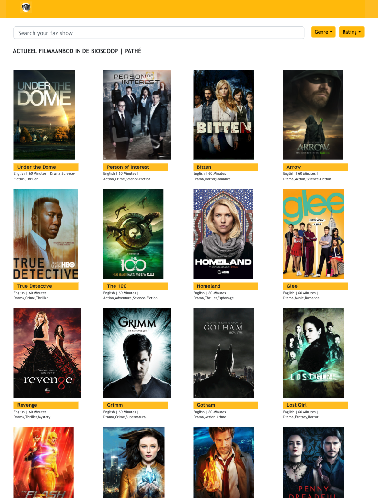

# Pathe Thuis

A Vuejs Project to consume api from `TVMAZE` (http://www.tvmaze.com/api), show the list of shows available. Allow the user to search for their favorite show, filter by Genre and Rating. User can also find additional information about the show such as Genre, Language, Runtime and Summary. Episode information about the show along with Season and duration of each episode.

# Application URL
https://main--pathe.netlify.app/

# Application Structure
List of views, component and route used in the application
# Views
   1. Dashboard
        - The landing component of the application. The dashboard component shows the list of shows available to the user
        - The dashboard provides a search bar to the user with auto complete to look for the favourite show
            - Auto complete or suggestion of show title matching the keyword is shown
            - When user complete the search, the matching show is shown
                - If no results found, then a message to the user is shown to refine the search criteria
        - The dashboard provides an option to the user to filter the shows based on  Genre or Rating
        - Dashboard provides show information such as
            - Title of the show
            - Language of the show
            - Duration 
            - Genre
        - By click on the Show, user can view more information of the show in a seperate show


2. Show Information 
    - The show information is rendered when user selects a show from the dashboard
    - The show information component provides the user the following
        - Information about the show such as 
            - Title
            - Language
            - Duration
            - Genre
            - Summary
            - Thumbnail 
            - Episode information 
                - A scrollbar (horizontal) list of episodes of the show
                - Episode information such as
                    - Title, 
                    - Season
                    - Duration of the episode


# Route Information

The Application has two routes 
1. Dashboard 
    - This is the default route to the application
    - Loads the list of all tv shows
    - Component/view: Dashboard
2. Show Information
    - This is loaded when user choose a specific show 
    - Loads the information about Show and Episode

# Styling
- Css (scoped) styling used on component level and view level


# Unit Testing
- As vue cli support is reduced, adding Vue Test Util is hard and its breaking the build. 
- Tried out Testing Library but its not suitable the view as Mount, Render options are bit different
- Currently, Trying to add unit test module to the application


# Improvements to the current approach
Technical
- Enable Typescript support to the project
- Enable Unit test
- Enable support of scoped style sheet

Feature
- Different styling for auto-complete of search
- Make it more responsive
- Better Result Not Found page
- Internationalization
- Dark & Light theme


# Resources
- Internationalization
https://santhoshkumarravi.medium.com/vue-js-internationalization-87623bbb41e8

- Filters
https://santhoshkumarravi.medium.com/vue-js-filters-a72929ba5aa1

- Custom Directives
https://santhoshkumarravi.medium.com/vuejs-custom-directives-tool-tip-b5eef501fec8

- Async / Dynamic Components
https://santhoshkumarravi.medium.com/vuejs-async-dynamic-components-7bab7bb8b3b4

- Conditional Rendering
https://santhoshkumarravi.medium.com/vue-js-conditional-rendering-c39bb8ac2470

- Props Validation
https://santhoshkumarravi.medium.com/vue-js-props-validator-c41ff5a6818a

- Vue PWA 
https://santhoshkumarravi.medium.com/vue-pwa-disable-5463e44b1f7f

## Source code checkout 
https://github.com/santhoshkumarravichandran/pathe
-https://santhoshkumarravi.medium.com/vue-pwa-disable-5463e44b1f7f


## Local setup

``` bash
# install dependencies
yarn install

# serve with hot reload at localhost:8080
yarn dev

# build for production with minification
yarn build --prod

# build for production and view the bundle analyzer report
yarn build --report

# run unit tests
yarn unit

# run all tests
yarn test

# run lint
yarn lint 

# run lint --fix
yarn lint  --fix
```

## Application Design

Dashboard screen


Show Information With Episode


Show Information


Episode


Navigation


Search Bar


